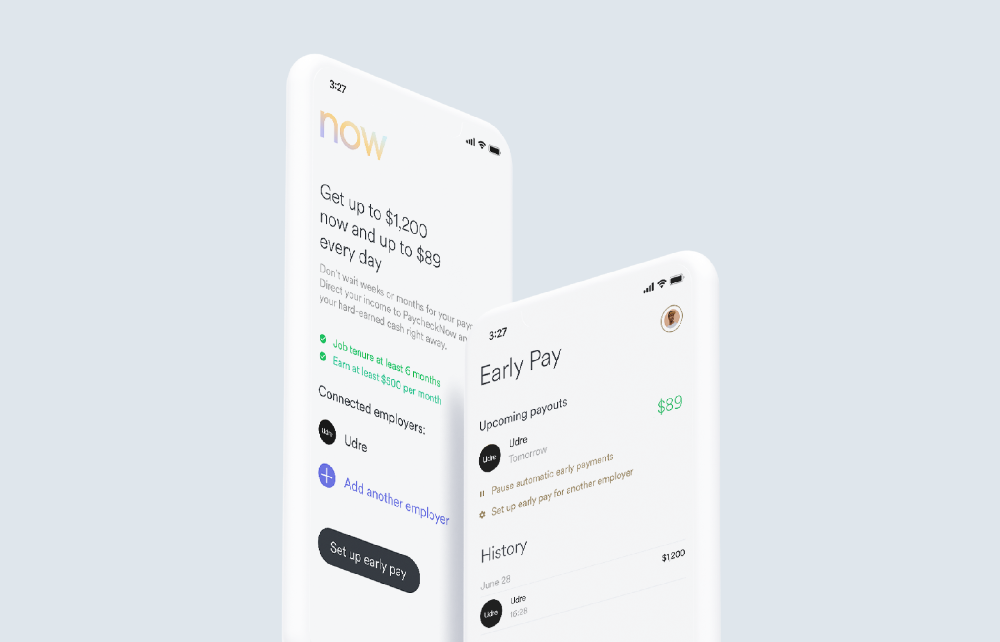

# PaycheckNow



With PaycheckNow, you can receive information about your customer’s already-earned income and deduct early payments directly from the customer’s payroll. PaycheckNow demonstrates how you can implement an earned wage access solution with Argyle.

You can try out the PaycheckNow demo [here](https://prebuilds.argyle.com/paychecknow) and learn more about the features [here](https://docs.argyle.com/guides/docs/paychecknow)

## Getting Started

1. Rename `env.example` to `.env` and fill in Argyle related keys from your https://console.argyle.com account. Do the same for Unit and Supabase related keys.

2. Install the dependencies

```bash
npm install
# or
yarn install
```

3. Run the development server:

```bash
npm run dev
# or
yarn dev
```

4. Open [http://localhost:3000/paychecknow](http://localhost:3000) with your browser to see the result.

## Tech stack

This is a [Next.js](https://nextjs.org/) project bootstrapped with [`create-next-app`](https://github.com/vercel/next.js/tree/canary/packages/create-next-app). It uses [Tailwind CSS](https://tailwindcss.com/) for styling and [Zustand](https://github.com/pmndrs/zustand) for state management.

Initial screen of the app is considered an `admin` page. Configuration is stored per cookie in a Supabase database.

## Prerequisites

- [Argyle Account](https://console.argyle.com/sign-up)
- [Unit Account](https://www.unit.co/)
- [Supabase Account](https://supabase.com/)

## Learn More

To learn more, take a look at the following resources:

- [Next.js Documentation](https://nextjs.org/docs) - learn about Next.js features and API.
- [Argyle Docs](https://argyle.com/docs) - learn about Argyle integration
